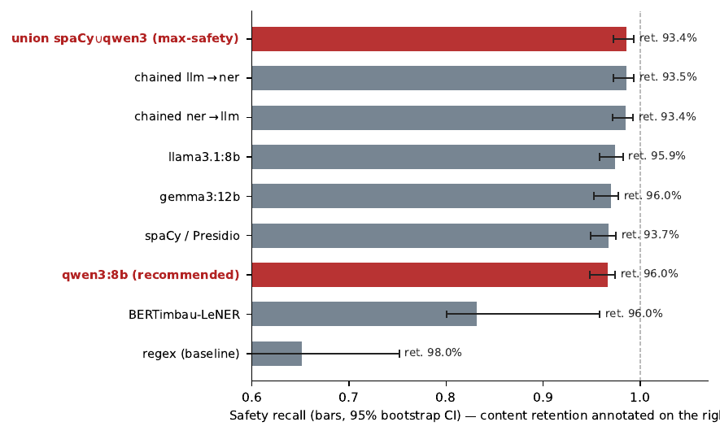

# Local Anonymization of Free-Text Robbery Police Reports (PT-BR)

A **fully local (on-premise)** pipeline, dataset, and tool for anonymizing the free-text
"Histórico" (narrative) field of Brazilian robbery police reports (*boletins de
ocorrência*, BOs), with all inference running on your own machine — no data ever leaves it.

This repository accompanies the paper **“Local Anonymization of Free-Text Robbery Police
Reports in Brazilian Portuguese: a Safety-Recall-Oriented Multi-Model Benchmark”** (KDMiLe).

> 🇧🇷 **Resumo (PT):** pipeline 100% local para anonimizar o campo "Histórico" de BOs de
> roubo, com dataset anotado, benchmark multimodelo e um aplicativo (interface web + API)
> para uso por forças policiais. Para rodar o aplicativo, veja [`app/README.md`](app/README.md).

---

## Highlights
- 📦 **Dataset** — first PT-BR corpus annotated for anonymization in the **police domain**:
  996 de-characterized robbery narratives with an entity-level PII gold standard
  ([datasheet](data/README.md)).
- 🔬 **Benchmark** — nine engine configurations (regex, NER, local LLMs, hybrids, Presidio)
  evaluated with a **safety-recall** metric, criticality analysis, and bootstrap CIs.
- 🛡️ **Tool** — a local app with web UI (login + admin) and a token-authenticated REST API
  ([`app/`](app/)).
- 🔒 **Privacy-first** — everything runs locally; supervised anonymization (human review of
  the residual ~1.4%); no claim of automatic LGPD compliance.

## Key results (N = 996)



| Configuration | Safety recall [95% CI] | Micro-F1 | Retention | Latency |
|---|---|---|---|---|
| **union (spaCy∪qwen3)** — max-safety | **0.986** [0.972; 0.994] | 0.50 | 0.93 | 7.0 s |
| **qwen3:8b** — recommended (best balance) | 0.966 [0.948; 0.974] | **0.83** | **0.96** | 3.7 s |
| spaCy / Presidio | 0.967 [0.948; 0.975] | 0.47 | 0.94 | 0.02 s |
| regex only (baseline) | 0.652 [0.595; 0.752] | 0.32 | 0.98 | 0.001 s |

Direct identifiers (documents, phones, e-mails) are removed at ~100%; residual risk
concentrates in low-criticality location quasi-identifiers. Full table in
[`results/tabela_comparativa.csv`](results/tabela_comparativa.csv).

## Repository structure
```
.
├── data/        Dataset (de-characterized) + datasheet
├── app/         Local app: web UI (login/admin) + REST API  → see app/README.md
├── results/     Frozen metrics (tables, CIs) + per-record outputs for reproduction
├── docs/        Figures
├── estagio1_regex.py / estagio2_motores.py   Two-stage pipeline (Stage 1 regex, Stage 2 semantic)
├── pipeline_anonimizacao_roubo.py            Pipeline runner
├── avaliar_pipeline.py                       Evaluation harness
├── analise_estatistica.py / metricas_utilidade.py / figura_tradeoff.py   Analyses & figure
├── eval_comum.py · config.yaml
├── requirements.txt · LICENSE · CITATION.cff
```

## Quickstart

### A) Run the anonymization tool (recommended for end users)
A local web app (single-text demo + batch spreadsheet) with login and a REST API.
See **[`app/README.md`](app/README.md)** for full instructions. In short:
```bash
cd app
pip install -r requirements.txt
python -m spacy download pt_core_news_lg
streamlit run app.py        # first launch creates the initial admin user
```
For the LLM presets, install [Ollama](https://ollama.com) and run `ollama pull qwen3:8b`.

### B) Reproduce the paper's numbers (no GPU/Ollama needed)
The frozen per-record outputs are in `results/per_record/`, so the tables, confidence
intervals, and figure can be recomputed directly:
```bash
pip install -r requirements.txt
python metricas_utilidade.py     # over-removal / retention per configuration
python analise_estatistica.py    # bootstrap 95% CIs + paired comparison
python figura_tradeoff.py        # regenerates the trade-off figure
```
To regenerate the per-record outputs from scratch (will differ slightly due to LLM
non-determinism), you also need spaCy + Ollama + the models, then run
`pipeline_anonimizacao_roubo.py` and `avaliar_pipeline.py`.

## The pipeline (two stages)
1. **Stage 1 — deterministic regex:** structured PII (CPF, RG, CNH, IMEI, plate, patrol
   car, phone, e-mail), tuned to the robbery domain. Substitution is case-insensitive and
   whole-word.
2. **Stage 2 — pluggable semantic layer:** person names, locations, establishments, and
   nicknames, via interchangeable back-ends — spaCy, BERTimbau-LeNER, local LLMs (qwen3:8b,
   llama3.1:8b, gemma3:12b) served by Ollama, union/chained hybrids, and Microsoft Presidio.

Presets exposed by the tool: **Recommended (qwen3:8b)**, **Maximum safety (union)**,
**Light/offline (spaCy)**.

## Responsible use
- 🔒 **Local only.** No data is sent to the internet. The REST API binds to `127.0.0.1` by
  default; never expose it directly to the internet.
- 👁️ **Supervised anonymization.** Review the residual (~1.4% of entities) before publishing.
- ⚖️ **No automatic LGPD compliance.** The pipeline substantially reduces PII-exposure risk;
  the legal framing of the anonymized data rests with the data controller.

## Requirements
Python 3.10+. See `requirements.txt` (reproduction) and `app/requirements.txt` (tool).
LLM presets require Ollama + a GPU is helpful (the paper's runs used a single NVIDIA
Quadro P4000 8 GB).

## License
- **Code:** MIT (see [`LICENSE`](LICENSE)).
- **Dataset:** CC BY 4.0 (see [`data/README.md`](data/README.md)).

## Citation
Please cite the paper (see [`CITATION.cff`](CITATION.cff)):

> de Almeida, M. G.; Botega, L. C.; de Paiva Lima, P. M. *Local Anonymization of Free-Text
> Robbery Police Reports in Brazilian Portuguese: a Safety-Recall-Oriented Multi-Model
> Benchmark.* Symposium on Knowledge Discovery, Mining and Learning (KDMiLe), 2026.

## Acknowledgements
Annotation and de-characterization by public-security experts of the São Paulo State Public
Security Department (SSP/CAP), coordinated by Cap. PM Paula Miwa de Paiva Lima.
